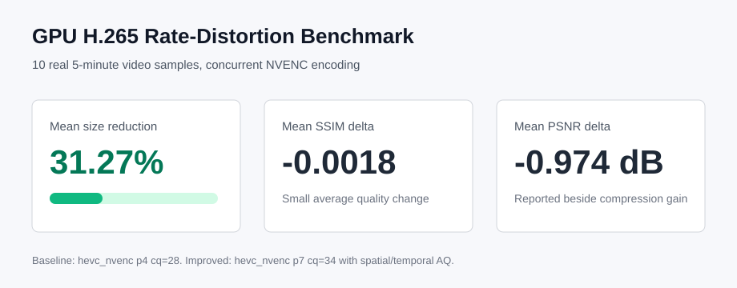

# x265-optimizer

GPU H.265 rate-distortion benchmark and optimization toolkit for real surveillance-style video.

The project compares an ordinary H.265/NVENC baseline with an improved GPU H.265 configuration that uses a higher quality preset and adaptive quantization. The goal is simple: reduce encoded size while keeping SSIM and PSNR close to the baseline.

## Result Snapshot

Benchmark: 10 real videos, 5 minutes per sample, concurrent GPU encoding.

| Metric | Result |
| --- | ---: |
| Completed samples | 10 / 10 |
| Mean size reduction | 31.27% |
| Mean SSIM delta | -0.001814 |
| Mean PSNR delta | -0.974 dB |
| Baseline bitrate | 1389.9 kbps |
| Improved bitrate | 898.8 kbps |



Full benchmark files are in [`benchmarks/2026-05-20-gpu-h265-rate-distortion`](benchmarks/2026-05-20-gpu-h265-rate-distortion).

## What Is Compared

Baseline:

- Encoder: `hevc_nvenc`
- Preset: `p4`
- Tune: `hq`
- Rate control: `vbr`
- Constant quality: `cq=28`

Improved:

- Encoder: `hevc_nvenc`
- Preset: `p7`
- Tune: `hq`
- Rate control: `vbr`
- Constant quality: `cq=34`
- Adaptive quantization: spatial AQ and temporal AQ enabled
- B-frame references enabled

The improved configuration is intentionally more aggressive on compression. The benchmark reports SSIM and PSNR so the quality cost is visible instead of hidden.

## Quick Start

Install runtime dependencies:

```bash
python -m venv .venv
.\.venv\Scripts\activate
python -m pip install -U pip
python -m pip install -r requirements.txt
```

External tools:

- FFmpeg with `hevc_nvenc` support
- NVIDIA GPU and driver
- `nvidia-smi` for environment metadata

Run the benchmark:

```bash
python tools/run_gpu_h265_benchmark.py ^
  --dataset E:\Video_Compression\5.6 ^
  --output-dir benchmarks\local-gpu-h265-rate-distortion ^
  --count 10 ^
  --seconds 300 ^
  --workers 4 ^
  --baseline-cq 28 ^
  --improved-cq 34
```

Outputs:

- `README.md`: GitHub-friendly benchmark report
- `results.csv`: spreadsheet-friendly full table
- `results.json`: machine-readable per-sample results
- `summary.json`: aggregate values
- `environment.json`: reproducibility metadata
- `artifacts/`: encoded videos and logs, ignored by Git by default

## Repository Layout

```text
tools/
  run_gpu_h265_benchmark.py       # Main GPU H.265 benchmark
  run_rate_distortion_benchmark.py # Experimental x265/scene-aware runner
src/
  *.py                            # Earlier benchmark and pipeline utilities
benchmarks/
  2026-05-20-gpu-h265-rate-distortion/
    README.md
    results.csv
    results.json
    summary.json
    environment.json
docs/
  assets/
    benchmark-summary.svg
```

## Important Notes

This repository intentionally does not bundle FFmpeg, x265 binaries, generated videos, or private source videos. Those files are large and can introduce license or privacy risk.

The published benchmark keeps only summary/report files. Encoded outputs under `artifacts/` are reproducible and ignored by Git.

## Development

Run syntax checks:

```bash
python -m py_compile tools\run_gpu_h265_benchmark.py tools\run_rate_distortion_benchmark.py
```

Run a short smoke benchmark:

```bash
python tools/run_gpu_h265_benchmark.py ^
  --dataset E:\Video_Compression\5.6 ^
  --output-dir benchmarks\smoke ^
  --count 2 ^
  --seconds 10 ^
  --workers 2
```

## License

MIT License. This project depends on external encoders and drivers; check FFmpeg, NVIDIA, and x265 licenses separately when redistributing binaries or derived artifacts.
