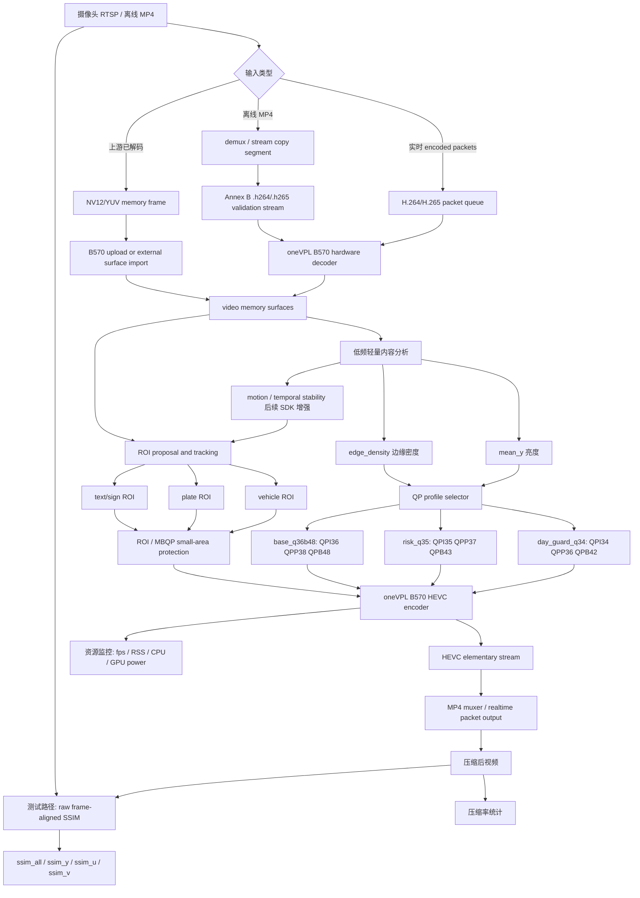

# B570 交通监控 H.265 压缩算法当前最优方案技术文档

日期：2026-06-02

本文总结当前 `combination` 融合算法的实际运行路径、已采用的技术方案、算法原理、实现方式，以及后续封装 SDK 时应该保留的接口形态。本文面向交通流监控场景，目标是单张 Intel Arc B570 支持 45 路 30fps 实时压缩，同时尽量达到平均压缩率约 85%~90%、平均 SSIM 大于 0.9、Y/U/V 各通道最低 SSIM 大于 0.81。

## 1. 当前直接结论

### 1.1 当前解码用的是核显还是 B570

当前 Linux 测试路径使用的是 B570，不是核显。

当前 oneVPL 参数里固定指定：

```text
-hw -device /dev/dri/renderD129
```

运行日志显示：

```text
Adapter type: discrete
DRMRenderNodeNum: 129
ImplName: mfx-gen
```

因此当前热路径是：

```text
B570 硬件解码 -> B570 视频内存 surface -> B570 硬件 HEVC 编码
```

没有把核显作为当前目标路径，也没有把核显作为 45 路吞吐的依赖。

### 1.2 当前输入是什么

当前验证输入是 Linux 硬盘上的原始 MP4 文件。测试脚本会先从每个视频里截取 10 分钟片段，然后把压缩码流抽成 Annex B elementary stream：

```text
H.264 MP4 -> .h264
H.265/HEVC MP4 -> .h265
```

之后 `sample_multi_transcode` 直接读取 `.h264` 或 `.h265` 压缩码流，让 B570 做硬件解码和硬件编码。

### 1.3 是否需要把输入视频转成保存的 YUV

不需要，也不建议。

当前生产热路径不保存完整 YUV 中间文件。原因是完整 YUV 文件的带宽成本太高。以 1080p NV12 30fps 为例：

```text
1920 * 1080 * 1.5 * 30 ~= 93 MB/s/路
45 路 ~= 4.2 GB/s
```

如果把每路视频都落盘成 YUV，会把瓶颈从 B570 编码器转移到磁盘、内存带宽和 CPU 调度上，实时系统会变得更脆弱。

当前只在两个非生产环节短暂产生 YUV 或灰度数据：

1. 内容风险探测：低分辨率灰度采样，约 `160x90`、少量帧，通过 stdout 读入，不落盘。
2. SSIM 测试：FFmpeg 内部把原视频和压缩后视频解码成 `yuv420p` 计算指标，不属于实时压缩路径。

SDK 的推荐输入是：

```text
接口 A：输入 H.264/H.265 压缩包，由 SDK 在 B570 上硬解再硬编。
接口 B：输入内存中的 NV12/YUV frame，适合上游已经完成解码的场景。
接口 C：离线 MP4 -> MP4，用于工程师测试和批处理。
```

## 2. 整个对话形成的核心判断

前期尝试里，单纯调 QP 阈值、按某几帧调 ROI、靠形状识别标牌，都会有过拟合风险。真正应该解决的不是“某一帧右侧文字有没有框住”，而是建立一条适合交通监控的通用压缩策略：

1. 不能整路固定降帧率，否则实时视频观感和事件连续性会受影响。
2. 帧复用只能用于真正静态、低运动、低风险的短片段，作为以后可选优化，不作为当前主线。
3. 不能把树叶、天空、路面细纹、阴影、车道线这类复杂但低价值区域长期低 QP 保护。
4. 车、人、车牌、车头车尾、动态目标、路侧文字和标牌是高价值区域，但 ROI 面积必须受控。
5. 白天视频比夜晚更难压，因为亮度高、纹理清晰、车道线/路面/树叶细节多，Y 通道更容易掉。
6. 夜晚视频通常更容易达到 95% 以上压缩率，但车灯、反光、车牌附近需要保护。
7. 45 路 30fps 的根本瓶颈不是某个小阈值，而是必须恢复并保持 oneVPL 真异步多路流水线。
8. 当前最有效的底层方向是：B570 硬解 + B570 硬编 + 多路异步 session + 长 GOP + B 帧 + 少量内容自适应 QP profile + 小面积 ROI/MBQP 保护。

## 3. 当前最优方案总览

当前最优方案可以概括为：

```text
真异步多路 oneVPL 硬件转码为主干，
内容风险分类选择少数 QP profile，
长 GOP + B 帧提升压缩率，
ROI/MBQP 只做小面积关键区域保护，
用 raw frame-aligned SSIM 做真实质量评估。
```

它不是单一算法，而是一个分层系统：

| 层级 | 作用 | 当前实现 |
|---|---|---|
| 输入层 | 读取摄像头或 MP4 的压缩码流 | 当前验证为 MP4 切段后抽 Annex B；SDK 应直接吃 encoded packet |
| 解码层 | 把 H.264/H.265 解成视频帧 | oneVPL B570 硬解，`/dev/dri/renderD129` |
| 分析层 | 判断白天/夜晚、亮度、边缘复杂度、风险 | 低分辨率灰度采样，少量帧 |
| 编码层 | 高吞吐 HEVC 压缩 | B570 硬编，CQP，B 帧，长 GOP |
| ROI 层 | 保护车、车牌、动态目标等关键区域 | 小面积 ROI/MBQP，低频分析，高频复用 |
| 质量层 | 验证 SSIM 和压缩率 | raw stream 对齐 SSIM，按 Y/U/V 通道统计 |
| 资源层 | 保证 45 路 30fps 不爆内存 | resource monitor 记录 RSS、可用内存、swap |

## 4. oneVPL 异步多路流水线

### 4.1 原理

旧方法能做到 45 路 30fps 的关键，是 oneVPL 的多路异步流水线，而不是某个 QP 阈值。

正确路径是把 45 路输入同时交给 oneVPL，每一路都是一个 decode -> encode session，B570 内部调度多个硬件任务。CPU 不逐帧等待每一路完成，而是不断提交任务、同步已完成任务、继续喂新帧。

这个结构减少了三个瓶颈：

1. CPU 不阻塞等待单路编码。
2. GPU 编码器有足够多路任务保持满负载。
3. 视频帧尽量停留在 video memory surface，减少 CPU/GPU 来回拷贝。

### 4.2 当前实现方式

当前验证使用 `sample_multi_transcode -par batch_xxx.par`，每个 par 文件里有 45 行左右转码任务。每行类似：

```text
-hw -device /dev/dri/renderD129 \
-i::h264 input.h264 \
-o::h265 output.h265 \
-u veryfast \
-async 2 \
-MemType::video \
-gpucopy::on \
-gop_size 300 \
-dist 4 \
-qpi 34/35/36 \
-qpp 36/37/38 \
-qpb 42/43/48
```

关键点：

- `-hw`：硬件路径。
- `-device /dev/dri/renderD129`：指定 B570。
- `-MemType::video`：使用视频内存 surface。
- `-gpucopy::on`：减少不必要 CPU 拷贝。
- `-async 2`：允许异步提交和同步。
- `-par`：一次运行多路 session，形成真实 45 路流水线。

当前 45 路批次已测到单路 session fps 约 32fps，说明 45 路 30fps 的吞吐方向是成立的。

## 5. GOP、B 帧和帧类型 QP

### 5.1 为什么用长 GOP

交通监控大多数时候画面背景稳定，摄像头固定，画面里主要变化来自车辆和行人。长 GOP 能让 P/B 帧更充分复用参考帧，显著降低码率。

当前设置：

```text
gop_size = 300
AdaptiveI = on
```

对 30fps 来说，GOP 300 约等于 10 秒。它能提高压缩率，但风险是：如果场景突变、强运动、镜头抖动、强光变化时，质量可能受影响。因此当前先使用 `AdaptiveI:on` 作为保护，让编码器在必要时插入更合适的 intra 保护。

后续 SDK 里更好的做法是动态 GOP：

```text
低运动稳定段：长 GOP，例如 300
中等运动段：中等 GOP，例如 120~180
强运动/场景切换：短 GOP 或触发 IDR
```

### 5.2 为什么加 B 帧

B 帧可以同时利用前后参考帧，压缩效率比只有 I/P 帧更高。交通监控不是远程操控或电竞直播，一般可以接受 1~2 帧级别的编码重排序延迟。

当前使用：

```text
dist = 4
```

这表示 IPB 结构里有 B 帧参与。相比全 P 帧，B 帧对达到白天更高压缩率尤其有帮助。

### 5.3 I/P/B 分别设置 QP

当前不使用单一全局 QP，而是给 I/P/B 不同 QP：

| 帧类型 | QP 倾向 | 原因 |
|---|---|---|
| I 帧 | 稍低 | I 帧是参考基础，太糊会污染后续预测 |
| P 帧 | 中等 | 兼顾质量和码率 |
| B 帧 | 更高 | B 帧不是长期参考，适合更激进压缩 |

当前 profile 示例：

```text
day_guard_q34: QPI=34, QPP=36, QPB=42
risk_q35:      QPI=35, QPP=37, QPB=43
base_q36b48:   QPI=36, QPP=38, QPB=48
```

降低 I 帧 QP 会降低压缩率，但通常能提升整体 SSIM，尤其是 Y 通道。当前策略是 I 帧更保守、B 帧更激进，以保持压缩率和质量的平衡。

## 6. 内容风险分类和 QP Profile

### 6.1 为什么不逐帧乱调 QP

逐帧 QP 如果太激进，会有三个问题：

1. CPU 分析成本高，影响 45 路实时性。
2. 质量波动明显，容易出现亮度/纹理跳变。
3. 很容易为了某些测试帧过拟合。

所以当前选择少量稳定 profile，而不是每帧细调。

### 6.2 当前特征

当前内容探测只用低成本特征：

```text
mean_y：平均亮度
edge_density：低分辨率边缘密度
```

实现方式：

1. FFmpeg 从源视频抽少量帧。
2. 缩放到约 `160x90`。
3. 转成灰度。
4. 计算平均亮度。
5. 用相邻像素梯度或简化边缘统计得到边缘密度。
6. 根据亮度和边缘密度选择 QP profile。

这不是为了精确理解每个物体，而是为了快速区分：

- 夜晚/低亮度，通常可更激进压缩。
- 白天高纹理，Y 通道风险较高。
- 明亮但边缘中等的道路/隧道入口场景，之前容易被误判成“容易压”，现在用 `day_guard_q34` 保护。

### 6.3 当前 QP Profile 规则

当前规则：

```text
if 95 <= mean_y <= 108 and 0.15 <= edge_density <= 0.225:
    profile = day_guard_q34
elif 95 <= mean_y <= 112 and edge_density > 0.25:
    profile = risk_q35
else:
    profile = base_q36b48
```

对应参数：

| Profile | QPI | QPP | QPB | 使用场景 |
|---|---:|---:|---:|---|
| day_guard_q34 | 34 | 36 | 42 | 白天亮度中高、边缘中等但 Y 通道容易掉的场景 |
| risk_q35 | 35 | 37 | 43 | 白天高边缘复杂场景 |
| base_q36b48 | 36 | 38 | 48 | 夜晚、低风险或大多数普通场景 |

这个规则不是按某几个视频 ID 写死，而是按亮度和边缘密度这种通用特征触发。

## 7. ROI / MBQP 策略

### 7.1 总原则

ROI 的目标不是“识别画面里所有复杂纹理”，而是保护交通监控价值最高的小区域。

ROI 分三层：

| ROI 类型 | 保护强度 | 面积预算 | 目的 |
|---|---|---|---|
| 车牌/车头车尾核心 | 最强 | 很小 | 保证车牌、车辆核心信息不糊 |
| 动态车辆主体 | 中等 | 中等 | 保证车辆轮廓和运动目标可辨 |
| 标牌/文字/路侧信息 | 较弱 | 很小 | 保留路侧重要信息和画面 OSD/文字 |

树叶、天空、马路细纹、阴影、车道线默认不保护，即使它们边缘复杂。

### 7.2 当前实现方式

当前 sample 路径打开了融合 ROI 逻辑，但限制它只做小面积保护：

```text
MFX50RT_SAMPLE_HYBRIDTSRQ=1
MFX50RT_SAMPLE_HYBRIDTSRQ_ROI_ONLY=1
MFX50RT_SAMPLE_HYBRIDTSRQ_DISABLE_FRAME_QP=1
MFX50RT_SAMPLE_DAYNIGHT_ADAPTIVE_QP=0
MFX50RT_SAMPLE_HYBRIDTSRQ_HEAVY_INTERVAL=5
MFX50RT_SAMPLE_MBQP_REUSE_INTERVAL=30
MFX50RT_SAMPLE_ROI_ANALYZE_INTERVAL=30
MFX50RT_SAMPLE_DISABLE_ROI_FROM_MBQP=1
MFX50RT_SAMPLE_ROI_DELTA_QP=-4
MFX50RT_SAMPLE_PLATE_ROI_DELTA_QP=-12
MFX50RT_SAMPLE_PLATE_ROI_MARGIN=24
MFX50RT_SAMPLE_MBQP_SAFE_MAX=38
```

含义：

- `ROI_ONLY=1`：ROI 只负责局部保护，不让全局 frame QP 逻辑乱跳。
- `DISABLE_FRAME_QP=1`：禁用过于复杂的逐帧自适应 QP。
- `HEAVY_INTERVAL=5`：重分析低频运行，避免每帧高成本计算。
- `MBQP_REUSE_INTERVAL=30`：QP map 可跨帧复用。
- `ROI_ANALYZE_INTERVAL=30`：ROI 分析低频运行。
- `ROI_DELTA_QP=-4`：普通 ROI 适度降低 QP。
- `PLATE_ROI_DELTA_QP=-12`：车牌疑似区域强保护。
- `PLATE_ROI_MARGIN=24`：车牌保护框适当扩边，避免漏保护。
- `MBQP_SAFE_MAX=38`：限制背景 QP 上限，防止 Y 通道被压坏。

### 7.3 为什么 MBQP 没有作为主压缩手段

MBQP 本身有用，但如果把它做成全图复杂 QP map，会遇到两个问题：

1. 它容易把树叶、路面、天空等复杂背景当成“重要区域”，反而降低压缩率。
2. 它每帧计算成本高，45 路 30fps 下容易吃 CPU 和内存带宽。

因此当前策略是：

```text
主压缩：HEVC CQP + B 帧 + 长 GOP + profile 选择
局部保真：小面积 ROI/MBQP
```

而不是：

```text
全图 MBQP 决定一切
```

## 8. 车牌、车辆、文字和标牌的通用 ROI 思路

当前必须坚持通用性，不按某一帧调阈值。

### 8.1 候选生成不是最终判定

圆形、矩形、横条、高对比文字块都只能作为 proposal，不能直接决定保护。否则会把车灯、树洞、护栏孔、广告板、窗户、树叶空洞都误判成标牌。

正确流程：

```text
候选生成 -> 反特征过滤 -> 语义价值评分 -> 面积预算 -> 最终 ROI
```

### 8.2 车辆 ROI

车辆 ROI 优先靠运动和时序，不靠单帧纹理。

实现思路：

1. 建立低分辨率背景模型或帧差图。
2. 找运动前景连通域。
3. 去掉明显阴影、车道线连接和大面积背景纹理。
4. 用时序稳定性保留真实移动车辆。
5. 对车辆框适当扩边。

车辆框略大不是主要问题，主要问题是避免大面积复杂背景被低 QP。

### 8.3 车牌 ROI

车牌不应该全图找，而应该在车辆 ROI 内部找。

实现思路：

1. 在车辆框内部搜索横向小矩形。
2. 宽高比约 `2:1` 到 `6:1`。
3. 边缘密度高，但面积小。
4. 位置偏车头/车尾中下区域。
5. 通过跨帧稳定性过滤偶然纹理。
6. 使用更强的 `plate_delta_qp` 保护。

### 8.4 文字 / 标牌 ROI

文字和标牌不能只靠形状，要做轻量打分：

```text
score =
  panel_boundary_score
+ internal_stroke_score
+ color_consistency_score
+ side_region_score
+ temporal_stability_score
- random_texture_score
- road_lane_score
- large_area_penalty
```

其中：

- `panel_boundary_score`：是否有稳定边界。
- `internal_stroke_score`：内部是否有文字/符号笔画结构。
- `color_consistency_score`：面板颜色是否相对一致。
- `side_region_score`：是否在路侧或画面边缘非车道区域。
- `temporal_stability_score`：是否跨帧稳定。
- `random_texture_score`：是否像树叶随机纹理。
- `road_lane_score`：是否像车道线或路面纹理。
- `large_area_penalty`：面积太大则降权。

最终还要加面积预算：

```text
文字/标牌 ROI 总面积建议 <= 0.5%~2%
车辆 ROI 总面积建议 <= 10%~20%
```

## 9. Y/U/V 通道质量策略

用户提出的判断是对的：Y 通道应该更保守，U/V 可以更激进。

原因：

- Y 通道承载亮度、边缘、纹理、人眼最敏感。
- U/V 通道承载色度，人眼敏感度较低，H.265 本身 4:2:0 对色度已经降采样。
- 交通监控中车牌边缘、车辆轮廓、文字笔画主要依赖 Y。

当前做法：

1. 不把背景 QP 提得太离谱，`MBQP_SAFE_MAX=38`。
2. QP profile 里 I/P 帧相对保守，B 帧更激进。
3. 质量评估按 `ssim_y`、`ssim_u`、`ssim_v` 分开统计。
4. 白天风险段用 `day_guard_q34`，优先修复 Y 通道 tail。

目前没有单独对 U/V 使用独立 QP，因为当前 oneVPL sample path 和 H.265 常规接口不一定直接支持稳定、通用、低风险的 per-plane QP 控制。后续如果做 SDK 深度封装，可以把色度 QP offset 作为可选能力探索，但当前不把它作为达标主线。

## 10. HEVC 输入启动保护

测试集中有些 HEVC 源在任意截取点附近不是完整 IDR 起点，直接从切段开头喂硬件解码会出现参考帧缺失，例如：

```text
Could not find ref with POC
Error constructing the frame RPS
MFX_ERR_DEVICE_FAILED
```

这不是 B570 性能问题，而是从压缩流中间截取导致的参考链不完整问题。

当前验证临时处理：

```text
HEVC segment extraction uses --hevc-start-offset 2.1
```

也就是对 HEVC 源测试片段稍微向后跳，避开不完整参考链。

SDK 中更合理的做法：

1. 摄像头实时流启动时等待 SPS/PPS/VPS。
2. 等到 IDR 或可解码的 CRA/BLA 帧再开始送入解码器。
3. 启动前的非参考完整帧可以丢弃。
4. 如果中途丢包导致参考链断裂，触发重同步或请求关键帧。

## 11. 当前测试和资源监控

当前正在 Linux 上跑：

```text
/home/admi/codex_eval/_codex_gun10m_profiled_v3_hevc_seek_guard
```

当前状态：

- batch_000 已通过。
- batch_001 正在运行。
- `sample_multi_transcode` 日志显示 B570 discrete adapter。
- 当前 sample RSS 约 2.45GB。
- 系统可用内存约 6.6GB。
- swap free 约 3.47GB，暂未看到内存耗尽迹象。

监控脚本记录字段：

```text
epoch
iso time
driver pid alive
driver rss / high water mark
sample process count
sample rss
ffmpeg count / rss
mem available
mem free
swap free / total
```

后续最终统计会输出：

```text
fps
compression_percent
ssim_all
ssim_y
ssim_u
ssim_v
profile
mean_y
edge_density
resource peak/min
```

## 12. SDK 最优接口设计

### 12.1 实时压缩接口

推荐接口：

```cpp
Mfx50EncoderHandle* mfx50_create_realtime_encoder(const Mfx50Config* cfg);
int mfx50_push_encoded_packet(Mfx50EncoderHandle* h,
                              const uint8_t* data,
                              size_t size,
                              int64_t pts,
                              int is_key_packet);
int mfx50_receive_packet(Mfx50EncoderHandle* h,
                         Mfx50Packet* out);
void mfx50_destroy(Mfx50EncoderHandle* h);
```

用途：

- 工程师从 RTSP/摄像头拿到 H.264/H.265 packet。
- 直接推给 SDK。
- SDK 内部用 B570 硬解、分析、硬编。
- 输出 MP4 muxer 或裸 HEVC packet。

### 12.2 内存 Raw Frame 接口

如果工程师已经把视频解码成 NV12/YUV，可用：

```cpp
int mfx50_push_raw_frame(Mfx50EncoderHandle* h,
                         const Mfx50RawFrame* frame);
```

注意：这里是内存 frame，不是要求保存 YUV 文件。

### 12.3 离线 MP4 压缩接口

用于 MP4 -> MP4：

```cpp
int mfx50_compress_mp4(const char* input_mp4,
                       const char* output_mp4,
                       const Mfx50Config* cfg,
                       Mfx50Report* report);
```

用途：

- 工程师批处理离线视频。
- SDK 内部负责 demux、decode、encode、mux。
- 可以输出压缩率、fps、错误码、是否跳过损坏片段等报告。

### 12.4 配置参数

建议少暴露内部细节，优先给工程师模式选择：

```cpp
typedef enum {
    MFX50_MODE_QUALITY,
    MFX50_MODE_COMPRESS_85,
    MFX50_MODE_TARGET_90,
    MFX50_MODE_CUSTOM
} Mfx50Mode;
```

核心配置：

```cpp
device: /dev/dri/renderD129 或自动选择 B570
mode: target_90 / compress_85 / quality
width, height, fps
input_codec: h264 / h265 / raw_nv12
output_codec: h265
max_latency_frames
enable_roi
enable_dynamic_gop
target_streams
```

## 13. 当前完整流程图



## 14. 目前方案的优点和限制

### 优点

1. 保持 B570 单卡主路径，不依赖核显。
2. 恢复 oneVPL 真异步多路流水线，吞吐能接近 45 路 30fps 要求。
3. 不保存 YUV 文件，避免磁盘和内存带宽爆炸。
4. 长 GOP + B 帧明显提高压缩效率。
5. I/P/B 分别设 QP，比单一全局 QP 更合理。
6. ROI/MBQP 只做小面积保护，降低误保树叶/路面/天空的风险。
7. raw frame-aligned SSIM 比 MP4 timestamp SSIM 更可靠。

### 限制

1. 当前 ROI 仍是轻量工程方案，还不是完整语义检测器。
2. 白天复杂道路视频压缩率可能无法稳定全都超过 90%，但应尽量保证 80%~86% 以上。
3. 当前 `day_guard_q34` 是通用亮度/边缘规则，但仍需要全量枪机测试验证。
4. HEVC 从任意截断点启动需要 IDR/参考链保护，SDK 里必须做成正式逻辑。
5. 色度 U/V 单独更激进压缩目前还不是主线，因为当前接口不稳定支持 per-plane QP。

## 15. 下一步执行计划

1. 等当前 v3 全量 10 分钟枪机测试跑完。
2. 汇总每个视频的 fps、压缩率、SSIM all/Y/U/V。
3. 汇总资源占用：sample peak RSS、系统最低可用内存、swap、CPU/GPU 功耗。
4. 检查未达标视频，区分：
   - 原视频损坏或不可解码。
   - HEVC 截断点参考链问题。
   - 白天 Y 通道真实质量不足。
   - 压缩率不足。
5. 如果只是少量白天视频压缩率 80%~86%，按用户容忍范围保留。
6. 如果 Y/U/V 有通道低于 0.81，优先用通用规则修复，避免按视频 ID 调参。
7. 达标后封装 SDK：
   - 可调用库。
   - B570 example。
   - 实时 encoded packet 接口。
   - raw memory frame 接口。
   - MP4 -> MP4 离线接口。
   - 工程师使用说明。
   - 文件结构说明。
   - 算法流程说明。
